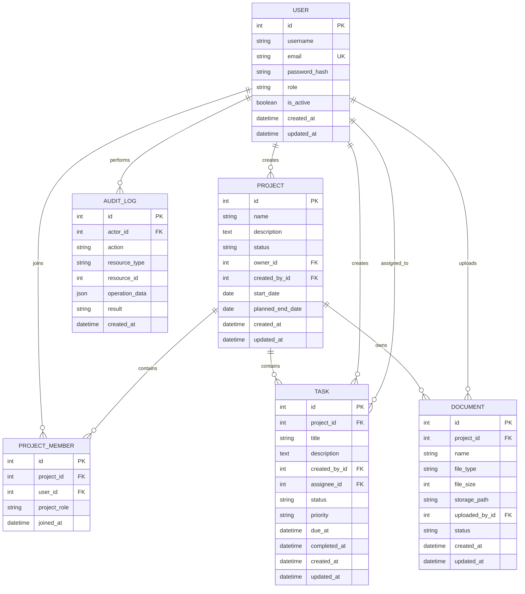

# EnterpriseFlow Agent 系统架构

## 1. 系统目标

EnterpriseFlow Agent 是一个面向企业内部知识查询和业务流程操作的智能助手。

系统首先构建用户、项目、任务和文档管理能力，再将这些业务能力封装为受限制的工具，供后续 Agent 调用。

系统设计需要同时满足以下要求：

* 业务数据能够持久化保存；
* API 输入和输出具有明确结构；
* 不允许大模型直接操作数据库；
* 修改数据前需要进行权限和参数校验；
* 重要操作可以被审计和追踪；
* 核心功能可以通过自动化测试验证。

## 2. 用户角色

### 普通员工

* 查看自己参与的项目；
* 查看和更新自己负责的任务；
* 查询企业文档；
* 使用智能助手查询相关信息。

### 项目负责人

* 创建和维护项目；
* 添加项目成员；
* 创建和分配任务；
* 查看项目任务进度；
* 管理项目相关文档。

### 系统管理员

* 管理系统用户；
  -停用异常账号；
* 管理企业文档；
* 查看系统审计日志；
* 维护系统运行配置。

## 3. 核心业务流程

### 3.1 创建项目

1. 用户提交项目名称和项目信息；
2. API 校验输入参数；
3. 系统检查用户是否有创建权限；
4. 数据库保存项目；
5. 创建人自动成为项目负责人；
6. 系统记录操作日志；
7. API 返回项目结果。

### 3.2 创建任务

1. 项目负责人提交任务信息；
2. 系统检查项目是否存在；
3. 系统检查负责人是否为项目成员；
4. 系统校验任务状态、优先级和截止时间；
5. 数据库保存任务；
6. 系统记录操作日志；
7. API 返回任务结果。

### 3.3 Agent 执行业务操作

后续 Agent 不会直接访问数据库，而是调用受限制的业务工具。

业务流程如下：

1. 用户提出自然语言请求；
2. Agent 判断用户意图；
3. Agent 选择业务工具；
4. 系统校验工具参数；
5. 系统检查用户权限；
6. 对写操作生成操作预览；
7. 用户确认；
8. 业务服务执行数据库操作；
9. 系统写入审计日志；
10. Agent 向用户返回执行结果。

## 4. 技术架构

系统采用分层结构：

```text
用户或客户端
      │
      ▼
FastAPI 路由层
      │
      ▼
业务服务层
      │
      ├── 参数和业务规则校验
      ├── 权限检查
      └── 审计日志
      │
      ▼
数据访问层
      │
      ▼
PostgreSQL 数据库
```

后续智能能力接入后：

```text
用户
 │
 ▼
Agent 对话接口
 │
 ▼
意图识别与工具选择
 │
 ▼
受限制的业务工具
 │
 ▼
业务服务层
 │
 ▼
PostgreSQL / 向量数据库
```

## 5. 后端模块规划

```text
app/
├── api/              # API 路由
├── core/             # 配置、安全和公共组件
├── db/               # 数据库连接和会话
├── models/           # SQLAlchemy 数据库模型
├── schemas/          # Pydantic 请求和响应模型
├── repositories/     # 数据访问逻辑
├── services/         # 业务逻辑
└── main.py           # FastAPI 应用入口
```

各层职责如下：

* `api`：接收 HTTP 请求并返回响应；
* `schemas`：定义请求和响应的数据格式；
* `services`：实现项目、任务等业务规则；
* `repositories`：封装数据库查询；
* `models`：定义数据库表结构；
* `db`：管理数据库连接和事务；
* `core`：管理配置、日志和安全功能。

## 6. 数据实体关系



## 7. 第一阶段技术栈

* Python 3.13；
* FastAPI；
* Pydantic；
* PostgreSQL；
* SQLAlchemy 2；
* Alembic；
* Psycopg 3；
* Pytest；
* Ruff；
* Git 和 GitHub。

## 8. 后续演进路线

### 阶段一：业务后端

完成用户、项目、任务、文档和审计日志管理。

### 阶段二：企业文档检索

增加文档解析、文本切分、向量化、混合检索和引用返回。

### 阶段三：Agent 工具调用

将查询项目、查询任务、创建任务和更新状态封装为业务工具。

### 阶段四：安全和可靠性

增加权限控制、操作确认、幂等处理、异常恢复和审计能力。

### 阶段五：自动化评测

建立 RAG 和 Agent 测试数据集，评测答案准确率、引用质量、工具选择准确率和任务执行成功率。
